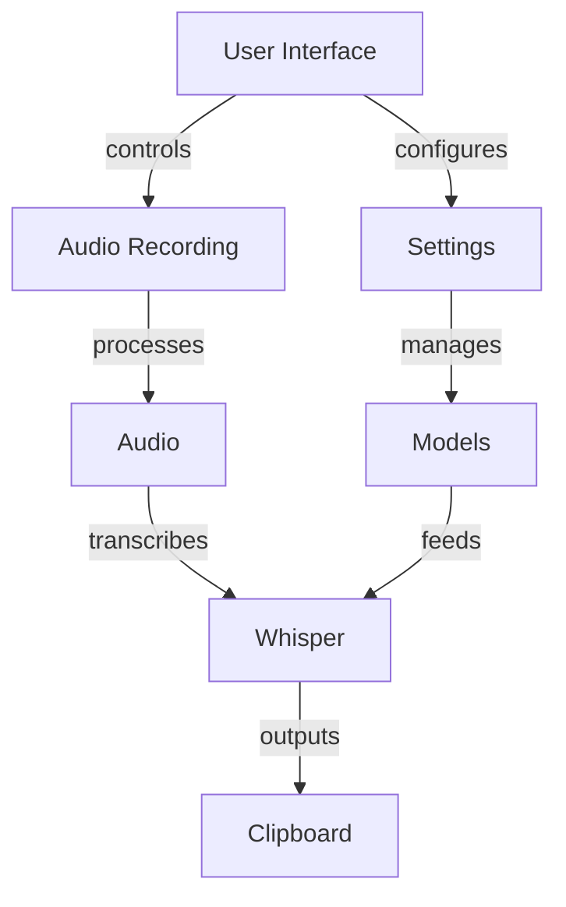

# Syllablaze Technical Summary

## Architecture

## Core Components
- **TrayRecorder**: Main controller
- **AudioRecorder**: Microphone handling
- **WhisperTranscriber**: Transcription
- **SettingsWindow**: Configuration
- **ModelManager**: Whisper model handling

## Tech Stack
- **GUI**: PyQt6
- **STT**: OpenAI Whisper
- **Audio**: PyAudio, ALSA/PulseAudio
- **Math**: NumPy/SciPy
- **Integration**: KDE Plasma, XDG

## Model Management
- Table UI for model selection
- Download/delete functionality (150MB-3GB/models)
- Filesystem-based detection
- Threaded downloads