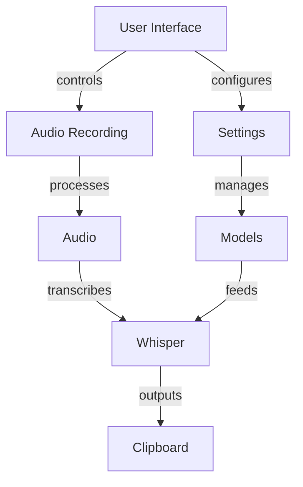
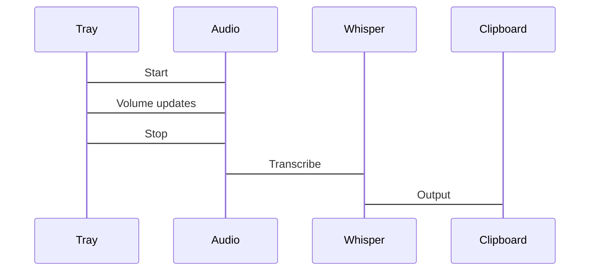
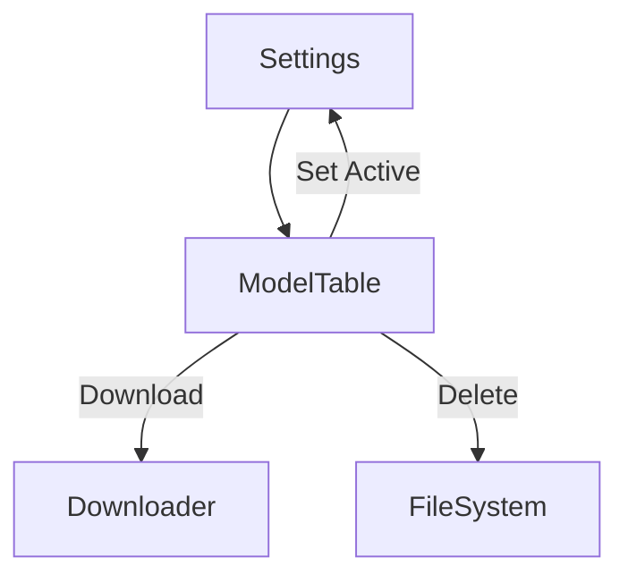

# Syllablaze System Patterns

## Core Architecture

## Key Components
- **TrayRecorder**: Main controller
- **AudioRecorder**: Microphone handling
- **WhisperTranscriber**: Transcription
- **SettingsWindow**: Configuration
- **ModelManager**: Whisper model handling
- **ProgressWindow**: Status feedback

## Technical Decisions
- **PyQt6**: Native KDE integration
- **Whisper**: Local, accurate STT
- **System Tray**: Minimal footprint
- **Modular Design**: Separation of concerns
- **User Directory Install**: Easy management

## Design Patterns
1. **Observer**: Signal/slot connections
2. **Singleton**: Settings access
3. **Factory**: Component creation
4. **Command**: UI action handling
5. **State**: App state management
6. **Thread**: Background operations

## Key Flows
### Recording Flow

### Model Management

## Error Handling
- Graceful degradation
- Clear user feedback
- Comprehensive logging
- Thread safety

## KDE Optimizations
- Path flexibility
- Dependency checks
- Desktop integration
- ALSA error handling