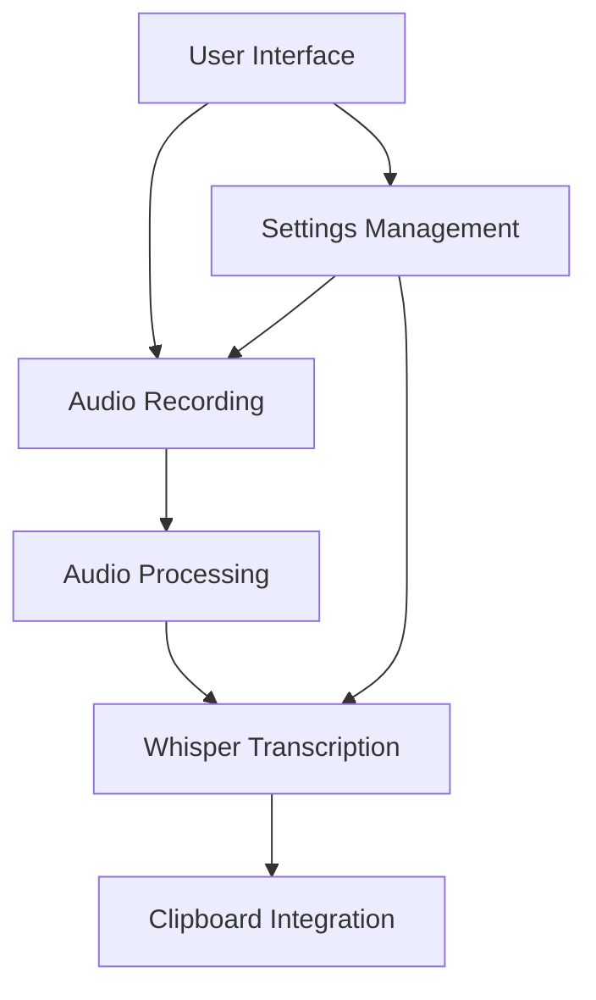

# Syllablaze System Patterns

## System Architecture

Syllablaze follows a modular architecture with clear separation of concerns. The application is structured around several key components that work together to provide a seamless user experience.

### High-Level Architecture

## Key Components

1. **TrayRecorder**: The central component that manages the application lifecycle and coordinates between other components
2. **AudioRecorder**: Handles microphone access and audio recording
3. **WhisperTranscriber**: Manages the Whisper model and transcription process
4. **SettingsWindow**: Provides user interface for configuration
5. **ProgressWindow**: Shows recording and transcription status
6. **GlobalShortcuts**: Manages keyboard shortcuts for controlling the application

## Key Technical Decisions

1. **PyQt6 for GUI**: Chosen for its native KDE integration and modern Qt features
2. **Whisper for Transcription**: Selected for its high accuracy and open-source nature
3. **System Tray Integration**: Provides minimal desktop footprint while maintaining accessibility
4. **Local Processing**: All audio processing and transcription happens locally for privacy
5. **User Directory Installation**: Application installs to user's home directory for easier management
6. **Modular Design**: Components are separated for easier maintenance and extension

## Design Patterns in Use

1. **Observer Pattern**: Signal/slot connections between components for loose coupling
2. **Singleton Pattern**: Settings class provides a single point of access for configuration
3. **Factory Pattern**: Audio and transcription components are created and managed by the main application
4. **Command Pattern**: Actions in the UI trigger specific commands in the backend
5. **State Pattern**: Application manages different states (idle, recording, processing)

## Component Relationships

### TrayRecorder and AudioRecorder

### TrayRecorder and WhisperTranscriber

### User Interface Flow

## Error Handling Strategy

1. **Graceful Degradation**: The application attempts to continue functioning even when parts fail
2. **User Feedback**: Clear error messages are shown to the user
3. **Logging**: Comprehensive logging for debugging
4. **Recovery Mechanisms**: Attempt to recover from errors when possible

## Ubuntu KDE Optimization Patterns

1. **Path Flexibility**: Support for alternative library paths common in Ubuntu
2. **Dependency Verification**: Check for required system dependencies before installation
3. **Desktop Integration**: Proper integration with KDE's application menu and system tray
4. **Error Suppression**: Handling of ALSA errors that are common in Ubuntu