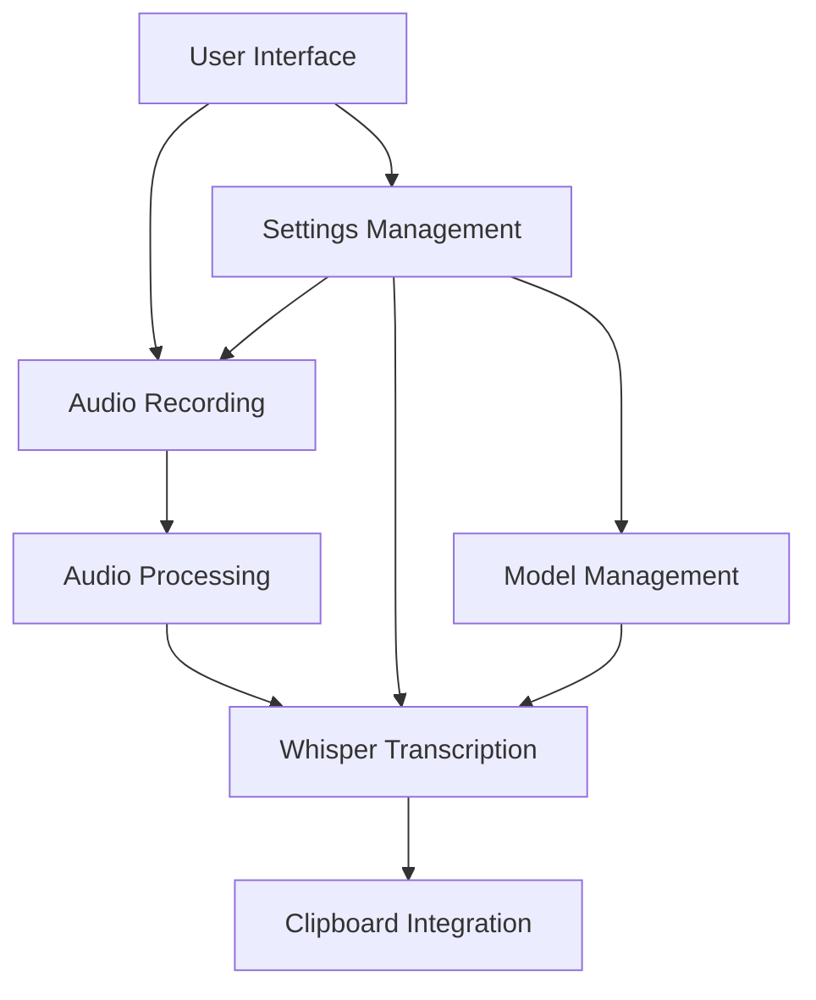

# Syllablaze Technical Summary

## Architecture

### Key Components
- **TrayRecorder**: Main application controller
- **AudioRecorder**: Handles microphone recording
- **WhisperTranscriber**: Manages transcription
- **SettingsWindow**: Configuration UI
- **WhisperModelManager**: Model download/management

## Tech Stack
### Core Technologies
- PyQt6 (GUI)
- OpenAI Whisper (Speech-to-Text)
- PyAudio (Audio Capture)
- NumPy/SciPy (Audio Processing)

### System Integration
- ALSA/PulseAudio (Audio)
- KDE Plasma (Desktop)
- XDG Standards (Installation)

## Model Management
### Features
- Table-based UI showing available models
- Download/delete functionality
- Storage management (150MB-3GB per model)
- In-memory processing without temp files

### Implementation Constraints
- No native download progress tracking (simulated)
- Model detection via filesystem scanning
- Threaded downloads for UI responsiveness

## Documentation
### Token Efficiency Tips
- Remove filler words
- Use concise expressions
- Prefer active voice
- Use lists/tables where possible