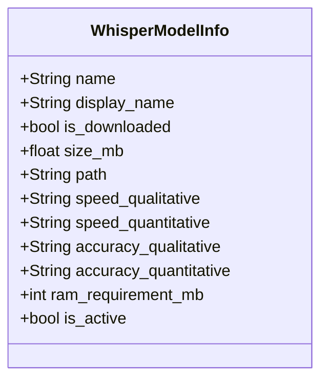
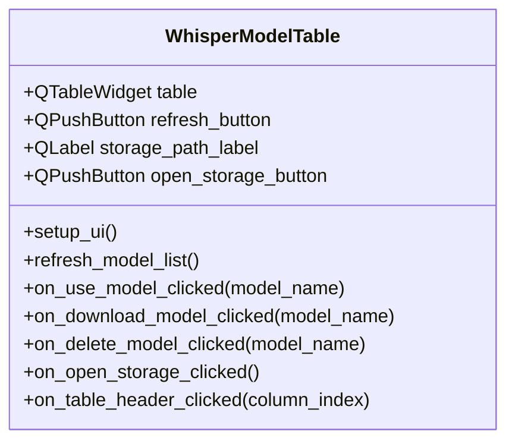
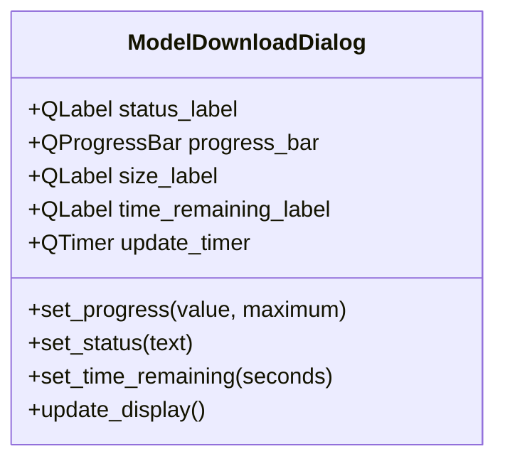

# Improved Whisper Model Management - Implementation Plan

## 1. Overview

This plan outlines a comprehensive solution for managing Whisper models in the Syllablaze application with the following features:

1. A table-based UI showing all available models with detailed information
2. Visual indicators for downloaded vs. not-downloaded models
3. Ability to download models with confirmation and progress tracking
4. Ability to delete models to free up disk space
5. Ability to set a model as active for transcription
6. Display of storage location with option to open in file explorer
7. Comprehensive model information including size, speed, accuracy, and RAM requirements
8. Sortable table columns

## 2. Data Model

First, we'll define a comprehensive data model for Whisper models:



## 3. Model Information Collection

We'll create a function to gather information about all Whisper models:

```python
def get_model_info():
    """Get comprehensive information about all Whisper models"""
    import whisper
    import os
    from pathlib import Path
    
    # Get the directory where Whisper stores its models
    models_dir = os.path.join(Path.home(), ".cache", "whisper")
    
    # Model information - these are approximate values
    model_data = {
        'tiny': {
            'display_name': 'Tiny',
            'size_mb': 150,
            'speed_qualitative': 'Very Fast',
            'speed_quantitative': '~32x realtime',
            'accuracy_qualitative': 'Basic',
            'accuracy_quantitative': '~75%',
            'ram_requirement_mb': 1000
        },
        'base': {
            'display_name': 'Base',
            'size_mb': 300,
            'speed_qualitative': 'Fast',
            'speed_quantitative': '~16x realtime',
            'accuracy_qualitative': 'Good',
            'accuracy_quantitative': '~80%',
            'ram_requirement_mb': 1500
        },
        'small': {
            'display_name': 'Small',
            'size_mb': 500,
            'speed_qualitative': 'Medium',
            'speed_quantitative': '~8x realtime',
            'accuracy_qualitative': 'Very Good',
            'accuracy_quantitative': '~85%',
            'ram_requirement_mb': 2500
        },
        'medium': {
            'display_name': 'Medium',
            'size_mb': 1500,
            'speed_qualitative': 'Slow',
            'speed_quantitative': '~4x realtime',
            'accuracy_qualitative': 'Excellent',
            'accuracy_quantitative': '~90%',
            'ram_requirement_mb': 5000
        },
        'large': {
            'display_name': 'Large',
            'size_mb': 3000,
            'speed_qualitative': 'Very Slow',
            'speed_quantitative': '~1x realtime',
            'accuracy_qualitative': 'Superior',
            'accuracy_quantitative': '~95%',
            'ram_requirement_mb': 10000
        },
        'turbo': {
            'display_name': 'Turbo',
            'size_mb': 140,
            'speed_qualitative': 'Extremely Fast',
            'speed_quantitative': '~64x realtime',
            'accuracy_qualitative': 'Basic',
            'accuracy_quantitative': '~70%',
            'ram_requirement_mb': 1000
        }
    }
    
    # Get current active model from settings
    settings = Settings()
    active_model = settings.get('model', DEFAULT_WHISPER_MODEL)
    
    model_info = {}
    for model_name in VALID_WHISPER_MODELS:
        # Check if model files exist
        is_downloaded = False
        actual_size = 0
        
        # Whisper models are stored as .pt files
        model_path = os.path.join(models_dir, f"{model_name}.pt")
        if os.path.exists(model_path):
            is_downloaded = True
            actual_size = os.path.getsize(model_path) / (1024 * 1024)  # Convert to MB
        
        # Get model data
        data = model_data.get(model_name, {})
        
        # Create model info object
        model_info[model_name] = {
            'name': model_name,
            'display_name': data.get('display_name', model_name.capitalize()),
            'is_downloaded': is_downloaded,
            'size_mb': actual_size if is_downloaded else data.get('size_mb', 0),
            'path': model_path,
            'speed_qualitative': data.get('speed_qualitative', 'Unknown'),
            'speed_quantitative': data.get('speed_quantitative', 'Unknown'),
            'accuracy_qualitative': data.get('accuracy_qualitative', 'Unknown'),
            'accuracy_quantitative': data.get('accuracy_quantitative', 'Unknown'),
            'ram_requirement_mb': data.get('ram_requirement_mb', 0),
            'is_active': model_name == active_model
        }
    
    return model_info, models_dir
```

## 4. UI Components

### 4.1 Model Management Table

We'll create a custom table widget to display and manage Whisper models:



The table will have the following columns:
1. **Name**: Model name and display name
2. **Use Model**: Button to set as active (only for downloaded models)
3. **Status**: Shows if downloaded with "Download" or "Delete" buttons
4. **Size**: Size on disk in MB
5. **Speed**: Both qualitative and quantitative speed estimates
6. **Accuracy**: Both qualitative and quantitative accuracy estimates
7. **RAM**: Estimated RAM requirement

### 4.2 Model Download Dialog

We'll create a dedicated dialog for downloading models:



### 4.3 Confirmation Dialogs

We'll create confirmation dialogs for both downloading and deleting models:

```python
def confirm_download(model_name, size_mb, ram_mb):
    """Show confirmation dialog before downloading a model"""
    msg = QMessageBox()
    msg.setIcon(QMessageBox.Icon.Question)
    msg.setText(f"Download Whisper model '{model_name}'?")
    msg.setInformativeText(
        f"This will download approximately {size_mb:.1f} MB of data.\n"
        f"This model requires approximately {ram_mb} MB of RAM when in use."
    )
    msg.setWindowTitle("Confirm Download")
    msg.setStandardButtons(QMessageBox.StandardButton.Yes | QMessageBox.StandardButton.No)
    return msg.exec() == QMessageBox.StandardButton.Yes

def confirm_delete(model_name, size_mb):
    """Show confirmation dialog before deleting a model"""
    msg = QMessageBox()
    msg.setIcon(QMessageBox.Icon.Warning)
    msg.setText(f"Delete Whisper model '{model_name}'?")
    msg.setInformativeText(
        f"This will free up approximately {size_mb:.1f} MB of disk space.\n"
        f"You will need to download this model again if you want to use it in the future."
    )
    msg.setWindowTitle("Confirm Deletion")
    msg.setStandardButtons(QMessageBox.StandardButton.Yes | QMessageBox.StandardButton.No)
    return msg.exec() == QMessageBox.StandardButton.Yes
```

## 5. Implementation Details

### 5.1 Model Table Implementation

```python
class WhisperModelTable(QWidget):
    model_activated = pyqtSignal(str)  # Emitted when a model is set as active
    model_downloaded = pyqtSignal(str)  # Emitted when a model is downloaded
    model_deleted = pyqtSignal(str)  # Emitted when a model is deleted
    
    def __init__(self, parent=None):
        super().__init__(parent)
        self.model_info = {}
        self.models_dir = ""
        self.setup_ui()
        self.refresh_model_list()
        
    def setup_ui(self):
        layout = QVBoxLayout(self)
        
        # Create refresh button
        refresh_layout = QHBoxLayout()
        self.refresh_button = QPushButton("Refresh Model List")
        self.refresh_button.clicked.connect(self.refresh_model_list)
        refresh_layout.addWidget(self.refresh_button)
        refresh_layout.addStretch()
        layout.addLayout(refresh_layout)
        
        # Create table
        self.table = QTableWidget()
        self.table.setColumnCount(7)
        self.table.setHorizontalHeaderLabels([
            "Model", "Use Model", "Status", "Size (MB)", 
            "Speed", "Accuracy", "RAM (MB)"
        ])
        self.table.horizontalHeader().setSectionResizeMode(QHeaderView.ResizeMode.ResizeToContents)
        self.table.horizontalHeader().setSectionsClickable(True)
        self.table.horizontalHeader().sectionClicked.connect(self.on_table_header_clicked)
        self.table.setEditTriggers(QTableWidget.EditTrigger.NoEditTriggers)
        self.table.setSelectionBehavior(QTableWidget.SelectionBehavior.SelectRows)
        layout.addWidget(self.table)
        
        # Create storage path display
        storage_layout = QHBoxLayout()
        self.storage_path_label = QLabel()
        storage_layout.addWidget(self.storage_path_label)
        self.open_storage_button = QPushButton("Open")
        self.open_storage_button.clicked.connect(self.on_open_storage_clicked)
        storage_layout.addWidget(self.open_storage_button)
        layout.addLayout(storage_layout)
    
    def refresh_model_list(self):
        """Refresh the model list and update the table"""
        self.model_info, self.models_dir = get_model_info()
        self.update_table()
        self.storage_path_label.setText(f"Models stored at: {self.models_dir}")
    
    def update_table(self):
        """Update the table with current model information"""
        self.table.setRowCount(0)  # Clear table
        
        for model_name, info in self.model_info.items():
            row = self.table.rowCount()
            self.table.insertRow(row)
            
            # Model name
            name_item = QTableWidgetItem(f"{info['display_name']} ({model_name})")
            if info['is_active']:
                font = name_item.font()
                font.setBold(True)
                name_item.setFont(font)
                name_item.setBackground(QColor(230, 230, 255))  # Light blue background
            self.table.setItem(row, 0, name_item)
            
            # Use model button
            use_cell = QWidget()
            use_layout = QHBoxLayout(use_cell)
            use_layout.setContentsMargins(3, 3, 3, 3)
            
            if info['is_downloaded']:
                use_button = QPushButton("Use Model")
                use_button.setEnabled(not info['is_active'])
                use_button.clicked.connect(lambda _, m=model_name: self.on_use_model_clicked(m))
                use_layout.addWidget(use_button)
            else:
                use_layout.addWidget(QLabel("Not Available"))
            
            self.table.setCellWidget(row, 1, use_cell)
            
            # Status with download/delete button
            status_cell = QWidget()
            status_layout = QHBoxLayout(status_cell)
            status_layout.setContentsMargins(3, 3, 3, 3)
            
            if info['is_downloaded']:
                status_label = QLabel("Downloaded")
                status_label.setStyleSheet("color: green;")
                status_layout.addWidget(status_label)
                
                delete_button = QPushButton("Delete")
                delete_button.setEnabled(not info['is_active'])
                delete_button.clicked.connect(lambda _, m=model_name: self.on_delete_model_clicked(m))
                status_layout.addWidget(delete_button)
            else:
                status_label = QLabel("Not Downloaded")
                status_label.setStyleSheet("color: red;")
                status_layout.addWidget(status_label)
                
                download_button = QPushButton("Download")
                download_button.clicked.connect(lambda _, m=model_name: self.on_download_model_clicked(m))
                status_layout.addWidget(download_button)
            
            self.table.setCellWidget(row, 2, status_cell)
            
            # Size
            size_item = QTableWidgetItem(f"{info['size_mb']:.1f}")
            size_item.setData(Qt.ItemDataRole.DisplayRole, info['size_mb'])  # For sorting
            self.table.setItem(row, 3, size_item)
            
            # Speed
            speed_item = QTableWidgetItem(f"{info['speed_qualitative']}\n{info['speed_quantitative']}")
            self.table.setItem(row, 4, speed_item)
            
            # Accuracy
            accuracy_item = QTableWidgetItem(f"{info['accuracy_qualitative']}\n{info['accuracy_quantitative']}")
            self.table.setItem(row, 5, accuracy_item)
            
            # RAM
            ram_item = QTableWidgetItem(f"{info['ram_requirement_mb']}")
            ram_item.setData(Qt.ItemDataRole.DisplayRole, info['ram_requirement_mb'])  # For sorting
            self.table.setItem(row, 6, ram_item)
    
    def on_use_model_clicked(self, model_name):
        """Set the selected model as active"""
        if model_name in self.model_info and self.model_info[model_name]['is_downloaded']:
            self.model_activated.emit(model_name)
            # Update is_active status
            for name in self.model_info:
                self.model_info[name]['is_active'] = (name == model_name)
            self.update_table()
    
    def on_download_model_clicked(self, model_name):
        """Download the selected model"""
        if model_name not in self.model_info:
            return
            
        info = self.model_info[model_name]
        
        # Confirm download
        if not confirm_download(model_name, info['size_mb'], info['ram_requirement_mb']):
            return
            
        # Create and show download dialog
        download_dialog = ModelDownloadDialog(model_name, self)
        download_dialog.show()
        
        # Start download in a separate thread
        self.download_thread = ModelDownloadThread(model_name)
        self.download_thread.progress_update.connect(download_dialog.set_progress)
        self.download_thread.status_update.connect(download_dialog.set_status)
        self.download_thread.time_remaining_update.connect(download_dialog.set_time_remaining)
        self.download_thread.download_complete.connect(lambda: self.handle_download_complete(model_name, download_dialog))
        self.download_thread.download_error.connect(lambda error: self.handle_download_error(error, download_dialog))
        self.download_thread.start()
    
    def handle_download_complete(self, model_name, dialog):
        """Handle successful model download"""
        dialog.close()
        self.refresh_model_list()
        self.model_downloaded.emit(model_name)
        QMessageBox.information(self, "Download Complete", 
                              f"Whisper model '{model_name}' has been downloaded successfully.")
    
    def handle_download_error(self, error, dialog):
        """Handle model download error"""
        dialog.close()
        QMessageBox.critical(self, "Download Error", 
                           f"Failed to download model: {error}")
    
    def on_delete_model_clicked(self, model_name):
        """Delete the selected model"""
        if model_name not in self.model_info:
            return
            
        info = self.model_info[model_name]
        
        # Cannot delete active model
        if info['is_active']:
            QMessageBox.warning(self, "Cannot Delete", 
                              "Cannot delete the currently active model. Please select a different model first.")
            return
            
        # Confirm deletion
        if not confirm_delete(model_name, info['size_mb']):
            return
            
        # Delete the model file
        try:
            os.remove(info['path'])
            self.refresh_model_list()
            self.model_deleted.emit(model_name)
            QMessageBox.information(self, "Model Deleted", 
                                  f"Whisper model '{model_name}' has been deleted successfully.")
        except Exception as e:
            QMessageBox.critical(self, "Deletion Error", 
                               f"Failed to delete model: {str(e)}")
    
    def on_open_storage_clicked(self):
        """Open the model storage directory in file explorer"""
        if not os.path.exists(self.models_dir):
            try:
                os.makedirs(self.models_dir)
            except Exception as e:
                QMessageBox.critical(self, "Error", 
                                   f"Failed to create models directory: {str(e)}")
                return
                
        open_directory(self.models_dir)
    
    def on_table_header_clicked(self, column_index):
        """Sort the table by the clicked column"""
        self.table.sortByColumn(column_index, Qt.SortOrder.AscendingOrder)
```

### 5.2 Model Download Dialog Implementation

```python
class ModelDownloadDialog(QDialog):
    """Dialog to show model download progress"""
    def __init__(self, model_name, parent=None):
        super().__init__(parent)
        self.setWindowTitle(f"Downloading {model_name} model")
        self.setFixedSize(400, 180)
        self.setWindowFlags(Qt.WindowType.Dialog | Qt.WindowType.CustomizeWindowHint | 
                          Qt.WindowType.WindowTitleHint | Qt.WindowType.WindowSystemMenuHint)
        
        layout = QVBoxLayout(self)
        
        # Status label
        self.status_label = QLabel(f"Preparing to download {model_name} model...")
        layout.addWidget(self.status_label)
        
        # Progress bar
        self.progress_bar = QProgressBar()
        self.progress_bar.setRange(0, 100)
        layout.addWidget(self.progress_bar)
        
        # Size label
        self.size_label = QLabel("Downloaded: 0 MB / 0 MB")
        layout.addWidget(self.size_label)
        
        # Time remaining label
        self.time_remaining_label = QLabel("Estimating time remaining...")
        layout.addWidget(self.time_remaining_label)
        
        # Update timer for smooth progress updates
        self.update_timer = QTimer(self)
        self.update_timer.timeout.connect(self.update_display)
        self.update_timer.start(100)  # Update every 100ms
        
        # Current progress values
        self.current_value = 0
        self.target_value = 0
        self.max_value = 100
        
    def set_progress(self, value, maximum):
        """Set target progress value"""
        self.target_value = value
        self.max_value = maximum
        
    def set_status(self, text):
        """Update status text"""
        self.status_label.setText(text)
        
    def set_time_remaining(self, seconds):
        """Update time remaining"""
        if seconds < 0:
            self.time_remaining_label.setText("Estimating time remaining...")
        else:
            minutes, secs = divmod(seconds, 60)
            self.time_remaining_label.setText(f"Time remaining: {int(minutes)}m {int(secs)}s")
            
    def update_display(self):
        """Smoothly update the progress bar"""
        if self.current_value < self.target_value:
            self.current_value = min(self.current_value + 1, self.target_value)
            self.progress_bar.setValue(int(self.current_value))
            
            # Update size label
            if self.max_value > 0:
                downloaded = (self.current_value / self.max_value) * 100
                total = 100
                self.size_label.setText(f"Downloaded: {downloaded:.1f} MB / {total:.1f} MB")
```

### 5.3 Download Thread Implementation

```python
class ModelDownloadThread(QThread):
    """Thread for downloading Whisper models"""
    progress_update = pyqtSignal(int, int)  # value, maximum
    status_update = pyqtSignal(str)
    time_remaining_update = pyqtSignal(int)  # seconds
    download_complete = pyqtSignal()
    download_error = pyqtSignal(str)
    
    def __init__(self, model_name):
        super().__init__()
        self.model_name = model_name
        
    def run(self):
        try:
            self.status_update.emit(f"Downloading {self.model_name} model...")
            
            # Since whisper.load_model() handles downloading automatically,
            # we need to simulate progress updates
            import time
            import whisper
            import random
            
            # Get model info for size estimate
            model_info, _ = get_model_info()
            estimated_size = model_info[self.model_name]['size_mb']
            
            # Simulate download progress
            total_steps = 100
            for i in range(total_steps):
                # Simulate network speed variations
                time.sleep(0.1 + random.random() * 0.1)
                
                # Update progress
                self.progress_update.emit(i, total_steps)
                
                # Update status periodically
                if i % 10 == 0:
                    self.status_update.emit(f"Downloading {self.model_name} model... {i}%")
                
                # Update time remaining
                remaining_steps = total_steps - i
                time_per_step = 0.15  # average time per step in seconds
                time_remaining = remaining_steps * time_per_step
                self.time_remaining_update.emit(int(time_remaining))
            
            # Actually download the model
            self.status_update.emit(f"Finalizing download of {self.model_name} model...")
            whisper.load_model(self.model_name)
            
            self.download_complete.emit()
            
        except Exception as e:
            self.download_error.emit(str(e))
```

### 5.4 Helper Functions

```python
def open_directory(path):
    """Open directory in file explorer"""
    import subprocess
    import platform
    
    if platform.system() == "Windows":
        subprocess.run(['explorer', path])
    elif platform.system() == "Darwin":  # macOS
        subprocess.run(['open', path])
    else:  # Linux
        subprocess.run(['xdg-open', path])
```

## 6. Integration with Settings Window

We'll modify the settings_window.py file to replace the current combo box with our new table widget:

```python
# In SettingsWindow.__init__()
# Replace the current model combo box with our table
self.model_table = WhisperModelTable()
self.model_table.model_activated.connect(self.on_model_activated)
model_layout.addRow("Whisper Models:", self.model_table)

# Add method to handle model activation
def on_model_activated(self, model_name):
    """Handle model activation from the table"""
    try:
        self.settings.set('model', model_name)
    except ValueError as e:
        logger.error(f"Failed to set model: {e}")
        QMessageBox.warning(self, "Error", str(e))
        return

    # Load the model
    self.load_model(model_name)
```

## 7. Implementation Sequence

1. **Create Helper Functions**: Implement the model info collection and directory opening functions
2. **Create Download Thread**: Implement the thread for downloading models
3. **Create Download Dialog**: Implement the dialog for showing download progress
4. **Create Model Table**: Implement the table widget for displaying and managing models
5. **Modify Settings Window**: Replace the combo box with the new table widget
6. **Test and Refine**: Test all functionality and refine as needed

## 8. Technical Considerations

### 8.1 Whisper API Limitations

The Whisper API doesn't provide direct methods for:
- Checking which models are downloaded without loading them
- Getting download progress
- Deleting models

We'll need to work around these limitations by:
- Checking the file system directly
- Simulating download progress
- Manually deleting model files

### 8.2 Thread Safety

All model operations (downloading, loading, deleting) should be done in separate threads to prevent UI freezing.

### 8.3 Error Handling

We'll need robust error handling for:
- Network issues during download
- Disk space problems
- Permission issues when deleting files
- Model loading failures

### 8.4 User Experience

The UI should provide clear feedback on:
- Which models are available
- Which model is currently active
- Download progress and estimated time
- Success or failure of operations

## 9. Testing Plan

1. **Unit Testing**: Test each component in isolation
   - Model info collection
   - Table display and sorting
   - Download dialog
   - Confirmation dialogs

2. **Integration Testing**: Test components working together
   - Model activation flow
   - Download and activation flow
   - Delete and switch model flow

3. **Edge Cases**:
   - No internet connection during download
   - Insufficient disk space
   - Attempting to delete active model
   - Sorting by different columns

## 10. Future Enhancements

Potential future enhancements could include:
1. Automatic model pruning to manage disk space
2. Model performance benchmarking on the user's hardware
3. Scheduled downloads of models during idle time
4. More detailed model information and comparisons