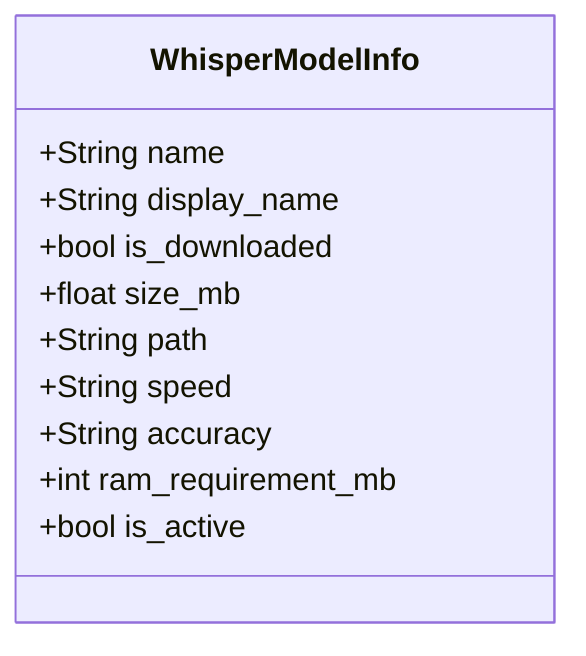

# Whisper Model Management Plan

## Core Features
- Table UI showing available models
- Download/delete functionality
- Model activation
- Storage location display
- Detailed model info (size, speed, accuracy, RAM)

## Data Model


## Key Components
1. **Model Table**:
   - Displays all models with status
   - Handles model activation
   - Manages download/delete actions

2. **Download Dialog**:
   - Shows progress
   - Estimates time remaining
   - Provides status updates

3. **Threaded Operations**:
   - Download in background
   - Keep UI responsive
   - Handle errors gracefully

## Implementation Highlights
```python
# Model info collection
def get_model_info():
    models_dir = Path.home()/".cache"/"whisper"
    return {
        'tiny': {'size_mb': 150, 'speed': '32x', 'accuracy': '75%', 'ram': 1000},
        # Other model specs...
    }

# Table implementation
class WhisperModelTable(QWidget):
    def refresh_model_list(self):
        self.model_info = get_model_info()
        self.update_table()

# Download thread
class ModelDownloadThread(QThread):
    def run(self):
        whisper.load_model(self.model_name)
```

## Integration
- Replace settings combo box with model table
- Connect signals for model activation
- Handle errors and user feedback

## Key Considerations
- Whisper API limitations (manual file handling)
- Thread safety for downloads/deletes
- Clear user feedback on all operations